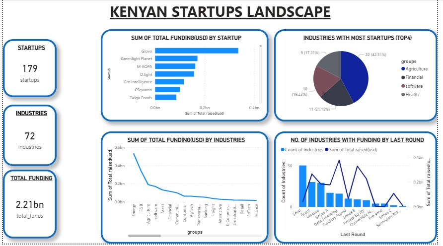
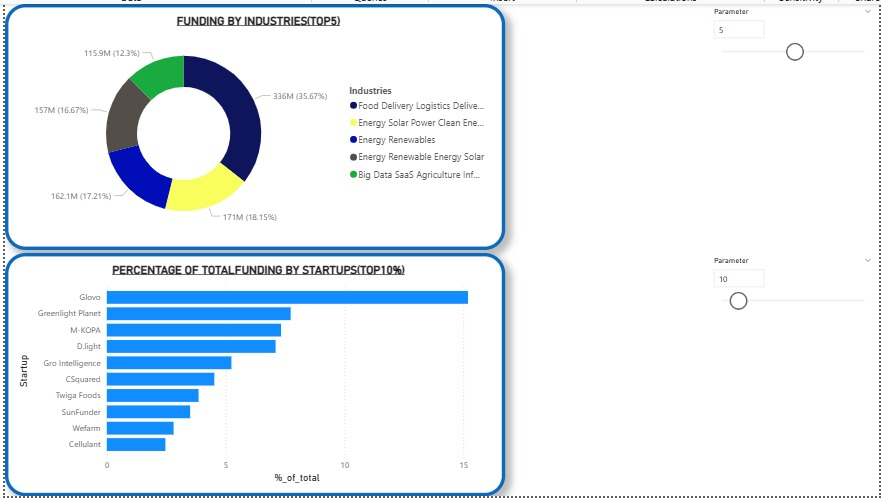

# Kenya's Startup Ecosystem Analysis - Power BI Dashboard

A comprehensive Power BI analysis of Kenya's startup landscape, funding trends, and sector performance. This dashboard provides insights into the African tech ecosystem's growth, challenges, and opportunities.

## 📊 Project Overview

This Power BI project tracks and visualizes Kenya's dynamic startup ecosystem, analyzing funding patterns, sector distribution, and the concentration of capital across the region's most promising ventures.

---

## 🇰🇪 Kenya's Startup Snapshot

### Key Metrics at a Glance
- **Total Startups Tracked**: 179
- **Industries Covered**: 72
- **Total Funding Raised**: $2.21 billion
- **Ecosystem Status**: Growing but concentrated

---

## 📸 Dashboard Visualizations

### Main Dashboard - Day 4


Comprehensive view of Kenya's startup ecosystem with key metrics and sector analysis.

### Detailed Analytics - Day 4 B


Deep-dive analysis of funding flows, industry distribution, and startup concentration patterns.

## 🏆 Top Funded Startups

Funding leaders dominating the landscape:

1. **Glovo** (Clear leader - ~15% of total funding)
2. **Greenlight Planet**
3. **M-KOPA**
4. **D.light**
5. **Gro Intelligence**

**Key Insight**: Top 10 startups capture a significant share of total funding, indicating high concentration in the ecosystem.

---

## 🏭 Industries with Most Startups

| Rank | Industry | Count | Percentage |
|------|----------|-------|-----------|
| 1 | Agriculture | 22 | 42.31% |
| 2 | Financial | 11 | 21.15% |
| 3 | Software | 10 | 19.23% |
| 4 | Health | 9 | 17.31% |

**Agricultural tech dominates** - Kenya's agricultural focus is clearly reflected in startup activity, with over 42% of tracked startups operating in the agricultural sector.

---

## 💰 Where the Money Flows - Top 5 Sectors

### Funding Distribution by Sector

| Sector | Amount | Share |
|--------|--------|-------|
| Energy | $0.6bn+ | Largest |
| Agriculture | $0.4bn | Second |
| Financial | $0.2bn+ | Third |
| Retail | Significant | Fourth |
| Food Delivery/Logistics | Major | Fifth |

---

## 🔍 Top Funded Industries Breakdown

| Industry | Funding | Percentage |
|----------|---------|-----------|
| Food Delivery/Logistics | $336M | 35.67% |
| Energy (Solar/Clean) | $171M | 18.15% |
| Energy Renewables | $162.1M | 17.21% |
| Renewable Energy/Solar | $157M | 16.67% |
| Big Data/SaaS/AgTech | $115.9M | 12.3% |

**Energy & Logistics Dominates**: The sector accounts for over 52% of total funding in top industries.

### Energy Sector Focus
The energy sector attracts the largest share of funding, potentially driven by:
- 🌍 Clean energy revolution momentum
- ⚡ Increasing power demand across East Africa
- 🔋 Investment in renewable energy infrastructure

---

## 📈 Funding by Round

### Funding Stage Distribution

- **Seed Stage**: Highest number of industries funded
- **Series A-C**: Declining participation
- **Later Stages**: Concentrated in fewer sectors

### Key Question
**Is Kenya's ecosystem struggling with scale-up capital?**

The data shows a significant drop-off in funding for Series A-C rounds, suggesting potential challenges in scaling ventures beyond the seed stage. This could indicate:
- Limited availability of growth-stage capital
- Risk aversion among later-stage investors
- Concentration of capital in specific high-performing companies

---

## 🎯 Funding Concentration Insights

### The Concentration Challenge

**Glovo's Dominance**: Glovo alone represents approximately **15% of total funding**, with just the top 10 startups holding a significant market share of all capital raised.

**Implications**:
- ✅ Shows presence of globally competitive startups
- ⚠️ Indicates ecosystem concentration risk
- 📊 Suggests uneven distribution of resources
- 🚀 Potential for more diverse unicorn creation

---

## 📊 Ecosystem Analysis

### Strengths
- ✅ Diverse sector representation (72 industries)
- ✅ Strong agricultural technology focus
- ✅ Presence of globally funded companies
- ✅ Growing clean energy investment
- ✅ Vibrant financial services sector

### Challenges
- ⚠️ High funding concentration in top companies
- ⚠️ Limited Series A-C capital availability
- ⚠️ Sector imbalance (energy/logistics over-represented)
- ⚠️ Scaling capital shortage
- ⚠️ Risk of boom-bust cycles

### Opportunities
- 🚀 AgTech innovation and expansion
- 🚀 Renewable energy transition
- 🚀 Financial inclusion initiatives
- 🚀 SaaS/Big Data solutions
- 🚀 Emerging sectors (Health, Software)

---

## 🛠️ Technical Details

### Dashboard Features
- Real-time startup ecosystem tracking
- Multi-dimensional funding analysis
- Industry sector breakdown and comparison
- Funding round distribution visualization
- Concentration metrics and trends
- Interactive drill-down capabilities

### Data Scope
- **Geographic Focus**: Kenya
- **Sector Coverage**: 72 industries
- **Company Count**: 179 startups tracked
- **Funding Data**: Comprehensive rounds analysis
- **Time Period**: Up-to-date ecosystem snapshot

### Tools & Technologies
- Power BI Desktop
- Power Query Editor
- DAX (Data Analysis Expressions)
- Multiple data sources integration

---

## 📋 Files Included

```
powerbi-project/
├── Startup_Ecosystem_Analysis.pbix    # Main Power BI workbook
├── screenshots/                        # Dashboard visualizations
│   ├── day 4.png                      # Main analysis dashboard
│   └── day 4 b.png                    # Detailed analytics view
├── Data/                              # Source data files
│   ├── startups.csv
│   ├── funding.csv
│   └── industries.csv
├── README.md                          # This file
└── .gitignore
```

---

## 🚀 Getting Started

### Prerequisites
- Microsoft Power BI Desktop (free or Pro)
- Data source access credentials
- Appropriate permissions for data review

### Installation Steps

1. **Clone the repository**
   ```bash
   git clone https://github.com/YOUR-USERNAME/kenya-startup-ecosystem.git
   cd kenya-startup-ecosystem
   ```

2. **Open the Power BI file**
   - Download Power BI Desktop from [microsoft.com](https://powerbi.microsoft.com/en-us/desktop/)
   - Open the `.pbix` file
   - Verify data source connections are active

3. **Refresh Data**
   - Click "Refresh All" to load the latest ecosystem data
   - Monitor for any connection or data validation errors
   - Review data quality and completeness

4. **Publish to Power BI Service (Optional)**
   - Click "Publish" in Power BI Desktop ribbon
   - Select your workspace
   - Share dashboard with stakeholders
   - Set up automatic refresh schedule

---

## 📊 Key Questions Answered

**Q: Where is Kenya's startup funding concentrated?**
- A: Heavily concentrated in top companies (Glovo ~15%), with top 10 capturing significant share

**Q: Which sectors attract the most investment?**
- A: Energy ($0.6bn+), Agriculture ($0.4bn), and Food Delivery/Logistics ($336M)

**Q: What percentage of startups focus on agriculture?**
- A: 42.31% (22 of tracked startups), reflecting Kenya's agricultural heritage

**Q: Is there enough Series A-C capital?**
- A: Evidence suggests potential shortage, with declining participation in growth stages

**Q: Why is the energy sector leading in funding?**
- A: Clean energy revolution, increasing power demand, and investor focus on sustainability

---

## 📈 Recommendations

### For Investors
- Diversify beyond top-funded companies
- Explore Series A-C opportunities in emerging sectors
- Support software and health tech innovators

### For Startups
- Target Series A-C fundraising carefully
- Consider strategic positioning in growing sectors
- Build networks with angel and growth-stage investors

### For Policymakers
- Address Series A-C capital gap
- Encourage fund diversification
- Support emerging sector development
- Promote regional balance beyond top cities

---

## 🔄 Data Refresh Schedule

- **Development**: Manual refresh
- **Production**: Daily refresh (if published to Power BI Service)
- **Last Updated**: May 2024

---

## 📞 Contact & Support

### Questions About the Dashboard
- Review data source documentation
- Check Power BI settings and permissions
- Verify data source connections
- Contact project maintainer

### About Kenya's Startup Ecosystem
- Explore individual startup profiles
- Review sector-specific deep dives
- Analyze funding round progression
- Study regional distribution patterns

---

## 📄 License

This project is licensed under the MIT License - see LICENSE file for details.

---

## 👥 Author

**Created**: May 2024  
**Focus**: Kenya's Startup Ecosystem Analysis  
**Last Updated**: May 2024  
**Version**: 1.0.0

---

## 🌍 Acknowledgments

This analysis is based on comprehensive tracking of Kenya's startup ecosystem, representing the collective efforts of the East African tech community and investment landscape.

---

**Note**: This dashboard provides a snapshot of Kenya's startup ecosystem. Data is continuously updated to reflect the dynamic nature of the startup landscape. For the most current information, verify with official sources and individual startup filings.
